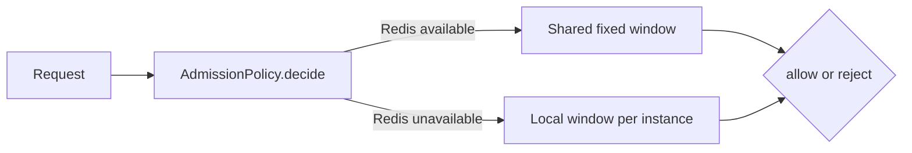

<Visual id="admission-path" title="Which counter decides a request">

```mermaid
flowchart LR
  Request --> Policy[AdmissionPolicy.decide]
  Policy -->|Redis available| Shared[Shared fixed window]
  Policy -->|Redis unavailable| Local[Local window per instance]
  Shared --> Result{allow or reject}
  Local --> Result
```

</Visual>
